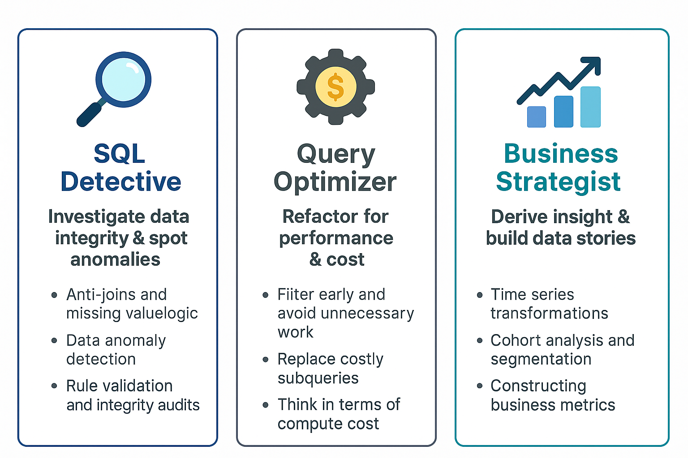
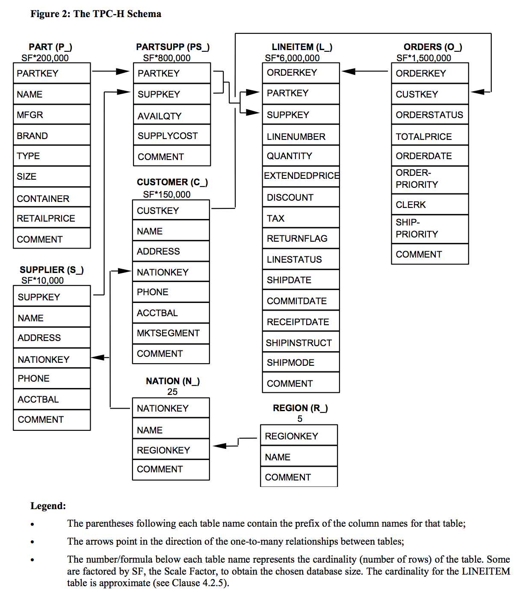

# 🎓 SQL Proficiency Workshop: Mastering Queries in Snowflake

Welcome to the **SQL Proficiency Workshop** — a hands-on, real-world training experience designed for analysts and analytical translators. 

Whether you’re brushing up on foundations or sharpening advanced techniques, this workshop is your launchpad to confident and efficient querying in **Snowflake**, using the TPCH sample database.

---

## 🧭 Workshop Format

The day is structured into two main components:

### 🔁 Part 1: Self-Paced Capability Ladder

Work through a progressively structured set of SQL exercises across three levels:

- **Level 1 (Foundations)** – Core SQL fluency (filtering, joining, aggregating)
- **Level 2 (Intermediate)** – Logic, expressions, grouping, subqueries
- **Level 3 (Advanced)** – CTEs, windows, cohorting, multi-table design

Each challenge is:
- Framed as a **realistic business question**
- Targeted toward **specific SQL capabilities**
- Supported with **starter queries**, **hints**, and **stretch goals**

### 🔀 Part 2: Track-Based Mini-Challenges

Choose your own adventure from three focused tracks — each emphasizing a different analytical lens:

<details>
<summary>🕵️ <b>SQL Detective</b> – Investigate Data Integrity & Spot Anomalies </summary>

This track encourages you to **think like a data auditor or QA engineer**. You'll work on finding missing links, detecting duplicates, identifying outliers, and verifying rule consistency.

**Key skills**:  
- Anti-joins, `LEFT JOIN` + `IS NULL`, `NOT EXISTS`  
- Logical validation using `CASE`, `DATEDIFF`, `LAG`, `RANK`  
- Auditing for temporal gaps, anomalies, and missing relationships  
</details>

<details>
<summary>⚙️ <b>Query Optimizer</b> – Refactor for Performance & Cost</summary>

Designed to **help you write better-performing SQL**, this track introduces cost-awareness, modular queries, and Snowflake-specific strategies.

**Key skills**:  
- Filter pushdown, predicate logic  
- Replace correlated subqueries with set-based joins  
- Leverage `QUALIFY`, CTEs, and materialization strategies  
- Understand query execution plans via `EXPLAIN`  
</details>

<details>
<summary>📊 <b>Business Strategist</b> – Derive Insight & Build Data Stories</summary>

This track focuses on **answering commercial and strategic questions** through SQL storytelling. Explore trends, segment behavior, and build actionable metrics.

**Key skills**:  
- Time series analysis (`DATE_TRUNC`, rolling averages)  
- Cohort definitions and KPI derivation  
- Ranking, contribution logic, and segmentation  
- Funnel metrics and retention patterns  
</details>


---

## 💾 The TPCH Database

We use the `SNOWFLAKE_SAMPLE_DATA.TPCH_SF1` dataset — a simplified business schema modeling customers, orders, parts, and suppliers.

| Table      | Description                                                                 |
|------------|-----------------------------------------------------------------------------|
| `CUSTOMER` | Customer profiles with segmentation and balance fields                     |
| `ORDERS`   | Order headers with status, priority, and date info                         |
| `LINEITEM` | Order lines with price, discount, and shipping detail                      |
| `PART`     | Individual products or SKUs with names and sizes                           |
| `SUPPLIER` | Supplier identities and comments                                            |
| `PARTSUPP` | Many-to-many mapping of parts to their suppliers and supply costs          |
| `NATION`   | Nation identifiers with region linkage                                     |
| `REGION`   | Continent-level grouping of nations                                        |

### Dataset Variants

- You’ll work primarily with **`TPCH_SF1`**, suitable for foundational learning.
- There are other variants of this database that **S**cale its records by a **F**actor, `TPCH_SF10`, `TPCH_SF100` and `TPCH_SF1000`. 
- You'll sometimes encounter exercises using these larger datasets to highlight performance and cost tradeoffs (particularly in **Part 2: Query Optimizer** track)

### Database Schema
You can find full database schema in the `img/` folder



---

## 📂 Repository Structure

This current repository contains the following contents that are relevant for you:

```
dpg-dataday-sql/
│
├── part1/                         ← Self-paced ladder (Levels 1–3)
│   ├── level1/
│   ├── level2/
│   └── level3/
│
├── part2/                         ← Track-based challenges
│   ├── track1\_detective/
│   ├── track2\_optimizer/
│   └── track3\_strategist/
│
├── img/                           ← Diagrams, schema snapshots
└── matrix.md                      ← Full list of exercises and metadata

```

Each `.md` file contains:

✅ A clear business question  
🧠 Context-specific logic and definitions  
🔧 A starter SQL snippet  
💡 Optional hint and reasoning guidance  
🎯 A verified solution (facilitator only)  
🎁 Bonus challenges to stretch your thinking  

---

## 🗂️ Exercise Overview (Placeholder)
Consult the `matrix.md` file for the full table of exercises and metadata.

<details>
<summary>Summary of exercises</summary>

| Part     | Track             | Level   | Exercise # | Title                        |
|----------|------------------|---------|------------|------------------------------|
| Part 1   | –                | Level 1 | ex01       | Top 10 Customers by Balance  |
| Part 1   | –                | Level 2 | ex11       | Revenue by Part and Discount |
| Part 1   | –                | Level 3 | ex21       | Cohort Revenue Growth        |
| Part 2   | Detective         | Level 1 | ex26       | Tag Food-Related Parts       |
| Part 2   | Optimizer         | Level 2 | ex58       | Optimized Join Order         |
| Part 2   | Strategist        | Level 2 | ex78       | Top Parts by Region          |

</details>

---

## 🧑‍💻 Getting Started

1. Navigate to any `.md` file and read the problem description.
2. Open the Snowflake Web UI.
3. Paste the starter query, apply your reasoning, and experiment.
4. Try the bonus task if you want to go beyond!

---

## 🧗 Self-Managing Your Learning Path

This workshop is **non-linear and learner-led**. You are in control.

### In Part 1:

* **Level 1** introduces foundational SQL skills.
* Move to **Level 2** when ready to expand your fluency.
* **Level 3** offers advanced transformations, windows, and cohorting.
* Step up or down depending on your confidence — growth is the goal.

### In Part 2:

* Tracks are self-contained. Pick one, or try them all.
* Feel free to change tracks or difficulty levels at any time.
* Done with one path? Switch it up and keep learning.

> **No pressure to finish everything. Focus on quality over quantity.**

---

## 🤝 Need Help?

* Facilitators are available throughout the day.
* Use hints when needed — or ask a peer for help.
* Finished early? Try a bonus, revisit a level, or challenge another track.

---

Let’s sharpen your SQL — with smart queries, real insights, and a community of curious minds.

**Happy querying!**


