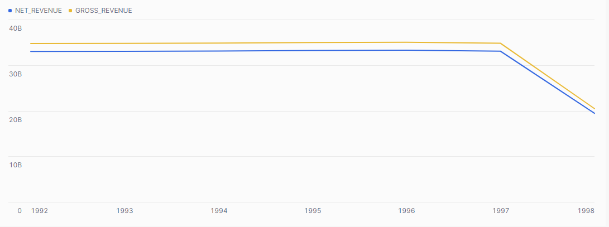

## ex67: Yearly Order Coverage and Summary Stats

> **Type:** Core | **Track:** Business Strategist  
>
> **Difficulty:** 3 / 10

### Business context
This assignment kicks off the **Momentum Matters** initiative — a structured effort by TPCH’s Strategy Director to analyze growth trends, portfolio performance, and commercial dependencies across years, products, and customer groups.

Before diving into any detailed calculations, it’s critical to confirm **which years contain complete data**. Inconsistent time coverage can lead to misleading metrics. You’ve been asked to:
1. Identify the **yearly date ranges** of order activity,
2. Calculate **basic summary stats** (gross revenue, discounts, and taxes),
3. Confirm which years can be trusted for year-over-year trend analysis.

This foundational check will inform the scope of future dashboards and strategic evaluations.

**Business logic & definitions:**
* order year = `YEAR(O_ORDERDATE)`
* net revenue = `L_EXTENDEDPRICE * (1 - L_DISCOUNT)`
* total discount = `L_EXTENDEDPRICE * L_DISCOUNT`
* total tax = `L_EXTENDEDPRICE * L_TAX`
* order = defined in `ORDERS`; revenue from matching rows in `LINEITEM`

### Starter query
```sql
-- Preview the orders and line items to understand date and pricing structure
SELECT
    O_ORDERKEY,
    O_ORDERDATE,
    L_EXTENDEDPRICE,
    L_DISCOUNT,
    L_TAX
FROM SNOWFLAKE_SAMPLE_DATA.TPCH_SF1.ORDERS O
JOIN SNOWFLAKE_SAMPLE_DATA.TPCH_SF1.LINEITEM L
  ON O.O_ORDERKEY = L.L_ORDERKEY
LIMIT 10;
```

### Required datasets

* `SNOWFLAKE_SAMPLE_DATA.TPCH_SF1.ORDERS`
* `SNOWFLAKE_SAMPLE_DATA.TPCH_SF1.LINEITEM`

<details>
<summary>💡 Hint (click to expand)</summary>

#### How to think about it

Start by joining orders and line items to get both the order date and pricing information. Use `YEAR()` to group by order year. Then compute:
- the **min and max** order date (per year),
- the **total extended price** (gross revenue),
- the **total discount** and **total tax** using calculated expressions.

#### Helpful SQL concepts

`YEAR()`, `GROUP BY`, `MIN()`, `MAX()`, arithmetic expressions

```sql
SELECT
  YEAR(order_date),
  SUM(price),
  SUM(price * discount)
FROM …
GROUP BY YEAR(order_date);
```

</details>

<details>
<summary>✅ Solution (click to expand)</summary>

#### Working query

```sql
SELECT
    YEAR(O.O_ORDERDATE) AS order_year,
    MIN(O.O_ORDERDATE) AS first_order_date,
    MAX(O.O_ORDERDATE) AS last_order_date,
    COUNT(DISTINCT O.O_ORDERKEY) AS num_orders,
    SUM(L.L_EXTENDEDPRICE) AS gross_revenue,
    SUM(L.L_EXTENDEDPRICE * L.L_DISCOUNT) AS total_discount,
    SUM(L.L_EXTENDEDPRICE * L.L_TAX) AS total_tax,
    SUM(L.L_EXTENDEDPRICE * (1 - L.L_DISCOUNT)) AS net_revenue
FROM SNOWFLAKE_SAMPLE_DATA.TPCH_SF1.ORDERS O
JOIN SNOWFLAKE_SAMPLE_DATA.TPCH_SF1.LINEITEM L
  ON O.O_ORDERKEY = L.L_ORDERKEY
GROUP BY YEAR(O.O_ORDERDATE)
ORDER BY order_year;
```

#### Why this works

This query joins orders with their line items to access both order date and pricing components. It groups the data by year and then aggregates key metrics: the time coverage and the financial performance.

Your Snowflake chart could look as follows:


#### Business answer

The year **1997** is the most recent full year of data, with complete coverage from January to December. It also has the highest gross and net revenue — making it the best candidate for deeper revenue analysis in the Momentum Matters series.

#### Take-aways

* Combine `MIN()`/`MAX()` with `YEAR()` to validate dataset completeness.
* Use simple expressions to break down pricing components like tax and discount.
* A well-structured `GROUP BY` can deliver both time audit and financial summary.
* Don't overlook basic temporal checks before diving into KPIs or trends.

</details>

<details>
<summary>🎁 Bonus Exercise (click to expand)</summary>

Add **average net revenue per order** to your query. Use `SUM(net_revenue) / COUNT(DISTINCT O_ORDERKEY)` or a CTE to cleanly separate steps.

Can you make a barchart in Snowflake, showing how the revenue per order changed over the years?

</details>
