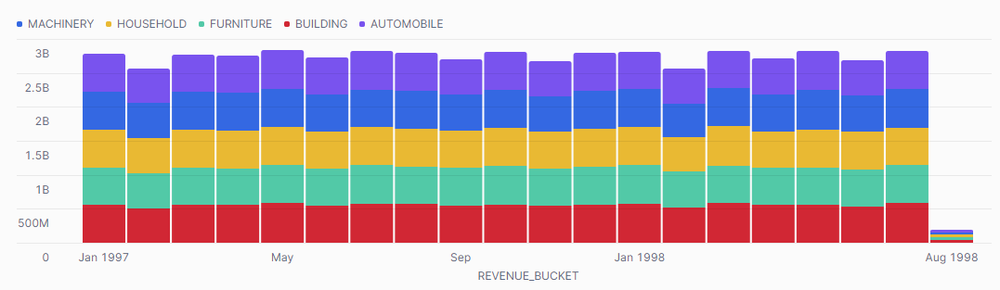

## ex68: Monthly Revenue Trend by Segment (Since 1997)

> **Type:** Core | **Track:** Business Strategist  
>
> **Difficulty:** 4 / 10

### Business context
Now that we’ve confirmed 1997 is the most recent full year of data, it’s time to dive into **how revenue has evolved over time**. The strategy team wants to see **monthly revenue trends** starting from January 1997 — both in total and broken down by **customer segment**. This analysis will form the backbone of a recurring executive dashboard.

Your task is to prepare a dataset suitable for use in **Snowflake’s built-in time series chart**. Make sure the output includes:
- the **month** (e.g., 1997-01, 1997-02, …),
- the **customer segment**,
- and the **net revenue** per month per segment.

**Business logic & definitions:**
* net revenue = `L_EXTENDEDPRICE * (1 - L_DISCOUNT)`
* analysis period = `O_ORDERDATE >= '1997-01-01'`
* time bucket = `DATE_TRUNC('MONTH', O_ORDERDATE)`
* customer segment = `C_MKTSEGMENT`

> 📊 **Once your query runs, use Snowflake's charting UI to visualize:**
> - X-axis: month
> - Y-axis: net revenue
> - A stacked or grouped bar chart, or one line per segment

### Starter query
```sql
-- Explore how orders and customers link together with time and segment info
SELECT
    O.O_ORDERDATE,
    C.C_MKTSEGMENT,
    L.L_EXTENDEDPRICE,
    L.L_DISCOUNT
FROM SNOWFLAKE_SAMPLE_DATA.TPCH_SF1.ORDERS O
JOIN SNOWFLAKE_SAMPLE_DATA.TPCH_SF1.LINEITEM L
  ON O.O_ORDERKEY = L.L_ORDERKEY
JOIN SNOWFLAKE_SAMPLE_DATA.TPCH_SF1.CUSTOMER C
  ON O.O_CUSTKEY = C.C_CUSTKEY
LIMIT 10;
```

### Required datasets

* `SNOWFLAKE_SAMPLE_DATA.TPCH_SF1.ORDERS`
* `SNOWFLAKE_SAMPLE_DATA.TPCH_SF1.LINEITEM`
* `SNOWFLAKE_SAMPLE_DATA.TPCH_SF1.CUSTOMER`

<details>
<summary>💡 Hint (click to expand)</summary>

#### How to think about it

Use `DATE_TRUNC('MONTH', O_ORDERDATE)` to bucket orders into months. Join with `CUSTOMER` to get the segment. Then aggregate **net revenue** per `(month, segment)`.

Make sure your output has **exactly one row per segment per month** so that Snowflake's charting engine can plot the result.

#### Helpful SQL concepts

`JOIN`, `DATE_TRUNC`, `GROUP BY`, `SUM()`

```sql
SELECT
  DATE_TRUNC('MONTH', order_date),
  segment,
  SUM(price * (1 - discount))
FROM …
GROUP BY 1, 2;
```

</details>

<details>
<summary>✅ Solution (click to expand)</summary>

#### Working query

```sql
SELECT
    DATE_TRUNC('MONTH', O.O_ORDERDATE) AS order_month,
    C.C_MKTSEGMENT AS customer_segment,
    SUM(L.L_EXTENDEDPRICE * (1 - L.L_DISCOUNT)) AS net_revenue
FROM SNOWFLAKE_SAMPLE_DATA.TPCH_SF1.ORDERS O
JOIN SNOWFLAKE_SAMPLE_DATA.TPCH_SF1.LINEITEM L
  ON O.O_ORDERKEY = L.L_ORDERKEY
JOIN SNOWFLAKE_SAMPLE_DATA.TPCH_SF1.CUSTOMER C
  ON O.O_CUSTKEY = C.C_CUSTKEY
WHERE O.O_ORDERDATE >= '1997-01-01'
GROUP BY 1, 2
ORDER BY 1, 2;
```

#### Why this works

This query outputs exactly what the charting layer needs: one row per segment per month, along with the total net revenue. `DATE_TRUNC` ensures consistent monthly buckets. The `WHERE` clause limits the analysis to relevant years.

Your Snowflake chart could look as follows:


#### Business answer

Once plotted, the chart shows a clear March 1997 revenue spike — but some segments spike more than others. It also shows how revenue flattens or varies by group across the year.

#### Take-aways

* Use `DATE_TRUNC('MONTH', …)` for monthly trend analysis.
* Join with `CUSTOMER` for segmentation overlays.
* Clean structure makes the output **chart-ready** in Snowflake.
* Always validate output format before visualizing: `(time, category, metric)`.

</details>

<details>
<summary>🎁 Bonus Exercise (click to expand)</summary>

Extend your query to also calculate **total orders per segment per month**. Consider showing both revenue and order volume in a dual-axis or split chart view.

</details>
