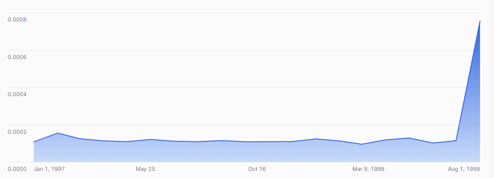

## ex71: Monthly Revenue Share of Top-Selling Product

> **Type:** Core | **Track:** Business Strategist  
>
> **Difficulty:** 6 / 10

### Business context
Executives want to understand **how dependent our revenue is on single best-selling items**. Specifically, they’ve asked:  
> “For each month since 1997, what percentage of total revenue came from just the #1 part?”

Your task is to compute, for each month:
- the **total revenue**,
- the **revenue from the highest-grossing part**, and
- the resulting **percentage share**.

This will help identify periods where the company may have been **over-reliant on a single product** — or conversely, times when revenue was more diversified.

> 📊 **Once you’ve run the query, create a bar or line chart** in Snowflake:
> - **X-axis**: month  
> - **Y-axis**: revenue share of the top part (as a percentage)  
> - **Chart title suggestion**: "Top Product Monthly Revenue Share"

**Business logic & definitions:**
* net revenue = `L_EXTENDEDPRICE * (1 - L_DISCOUNT)`
* month = `DATE_TRUNC('MONTH', O_ORDERDATE)`
* use `RANK()` within each month to find the top 1 part
* calculate share = top part revenue ÷ total revenue that month

### Starter query
```sql
-- Explore how part keys and order dates relate to revenue
SELECT
    P.P_PARTKEY,
    O.O_ORDERDATE,
    L.L_EXTENDEDPRICE,
    L.L_DISCOUNT
FROM SNOWFLAKE_SAMPLE_DATA.TPCH_SF1.ORDERS O
JOIN SNOWFLAKE_SAMPLE_DATA.TPCH_SF1.LINEITEM L
  ON O.O_ORDERKEY = L.L_ORDERKEY
JOIN SNOWFLAKE_SAMPLE_DATA.TPCH_SF1.PART P
  ON L.L_PARTKEY = P.P_PARTKEY
LIMIT 10;
```

### Required datasets

* `SNOWFLAKE_SAMPLE_DATA.TPCH_SF1.ORDERS`
* `SNOWFLAKE_SAMPLE_DATA.TPCH_SF1.LINEITEM`
* `SNOWFLAKE_SAMPLE_DATA.TPCH_SF1.PART`

<details>
<summary>💡 Hint (click to expand)</summary>

#### How to think about it

Start by computing net revenue per `(month, part_key)`. Then:
1. Use `RANK()` to find the top part per month.
2. Compute total revenue per month as a second CTE.
3. Join both together to calculate the percentage share.

#### Helpful SQL concepts

`GROUP BY`, `SUM()`, `RANK() OVER (PARTITION BY … ORDER BY …)`, `QUALIFY`, `JOIN`, arithmetic

</details>

<details>
<summary>✅ Solution (click to expand)</summary>

#### Working query

```sql
WITH monthly_part_revenue AS (
  SELECT
    DATE_TRUNC('MONTH', O.O_ORDERDATE) AS order_month,
    P.P_PARTKEY AS part_key,
    SUM(L.L_EXTENDEDPRICE * (1 - L.L_DISCOUNT)) AS net_revenue
  FROM SNOWFLAKE_SAMPLE_DATA.TPCH_SF1.ORDERS O
  JOIN SNOWFLAKE_SAMPLE_DATA.TPCH_SF1.LINEITEM L ON O.O_ORDERKEY = L.L_ORDERKEY
  JOIN SNOWFLAKE_SAMPLE_DATA.TPCH_SF1.PART P ON L.L_PARTKEY = P.P_PARTKEY
  WHERE O.O_ORDERDATE >= '1997-01-01'
  GROUP BY order_month, part_key
),
top_part_per_month AS (
  SELECT
    order_month,
    part_key,
    net_revenue,
    RANK() OVER (PARTITION BY order_month ORDER BY net_revenue DESC) AS part_rank
  FROM monthly_part_revenue
  QUALIFY part_rank = 1
),
monthly_total AS (
  SELECT
    order_month,
    SUM(net_revenue) AS total_revenue
  FROM monthly_part_revenue
  GROUP BY order_month
)
SELECT
    t.order_month,
    t.part_key AS top_part_key,
    t.net_revenue AS top_part_revenue,
    m.total_revenue,
    t.net_revenue / m.total_revenue AS top_part_share
FROM top_part_per_month t
JOIN monthly_total m
  ON t.order_month = m.order_month
ORDER BY t.order_month;
```

#### Why this works

We first compute monthly revenue by part, then rank the parts to isolate the top performer per month. We then join that with the total revenue for the same month to calculate the share — giving insight into product concentration over time.

Your visual should look as follows:



#### Business answer

The resulting chart shows that also over time, our revenue is never driven by a single item in our portfolio. 
No single product accounts for anywhere near a percent of our total monthly revenue. Though the recent spike is concerning.  
This metric could help track dependency and resilience in the product portfolio.

#### Take-aways

* Use `RANK()` with `PARTITION BY` to isolate top performers within groups.
* Combining CTEs allows you to layer logic clearly and scalably.
* Time + entity grouping unlocks powerful trends.

</details>

<details>
<summary>🎁 Bonus Exercise (click to expand)</summary>

Does the conclusion change if one looks at weekly or daily data? 

</details>
