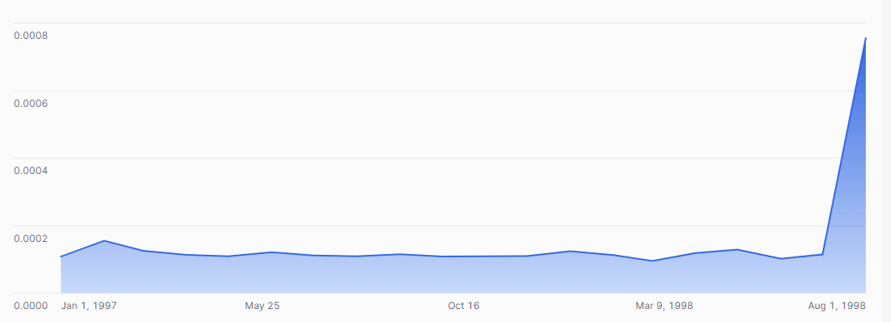

## ex72: Monthly Revenue Share of Top-Selling Product

> **Type:** Core | **Track:** Business Strategist  
>
> **Difficulty:** 6 / 10

### Business context
As part of the **Momentum Matters** initiative, the CFO has raised a concern during a leadership meeting:

> “I keep seeing strong monthly sales — but what if it’s just one or two items doing all the heavy lifting?”

To explore this concern, you've been asked to examine **whether the company is over-reliant on a small set of top-selling products**. The CFO wants to know, for each month since 1997:
- Which product generated the most revenue?
- What **percentage of total monthly revenue** came from just that one product?

This analysis will help determine whether TPCH’s growth is **broad-based or dangerously concentrated**, and whether that pattern is **improving or worsening over time**.

> 📊 Use Snowflake’s charting UI to visualize:
> - X-axis = month  
> - Y-axis = revenue share of top product  
> - Recommended chart: line or bar chart titled **“Monthly Revenue Share of #1 Product”**

**Business logic & definitions:**
* net revenue = `L_EXTENDEDPRICE * (1 - L_DISCOUNT)`
* month = `DATE_TRUNC('MONTH', O_ORDERDATE)`
* top product = highest-grossing `P_PARTKEY` per month
* revenue share = top product revenue ÷ total monthly revenue

### Starter query
```sql
-- Explore how part keys and order dates relate to revenue
SELECT
    P.P_PARTKEY,
    O.O_ORDERDATE,
    L.L_EXTENDEDPRICE,
    L.L_DISCOUNT
FROM SNOWFLAKE_SAMPLE_DATA.TPCH_SF1.ORDERS O
JOIN SNOWFLAKE_SAMPLE_DATA.TPCH_SF1.LINEITEM L
  ON O.O_ORDERKEY = L.L_ORDERKEY
JOIN SNOWFLAKE_SAMPLE_DATA.TPCH_SF1.PART P
  ON L.L_PARTKEY = P.P_PARTKEY
LIMIT 10;
```

### Required datasets

* `SNOWFLAKE_SAMPLE_DATA.TPCH_SF1.ORDERS`
* `SNOWFLAKE_SAMPLE_DATA.TPCH_SF1.LINEITEM`
* `SNOWFLAKE_SAMPLE_DATA.TPCH_SF1.PART`

<details>
<summary>💡 Hint (click to expand)</summary>

#### How to think about it

1. Compute net revenue per part per month.
2. Use `RANK()` to find the #1 product per month.
3. Calculate total monthly revenue separately.
4. Join and divide to compute the share of revenue from the top product.

#### Helpful SQL concepts

`DATE_TRUNC`, `GROUP BY`, `RANK()`, `JOIN`, division

```sql
RANK() OVER (PARTITION BY month ORDER BY revenue DESC)
```

</details>

<details>
<summary>✅ Solution (click to expand)</summary>

#### Working query

```sql
WITH monthly_part_revenue AS (
  SELECT
    DATE_TRUNC('MONTH', O.O_ORDERDATE) AS order_month,
    P.P_PARTKEY AS part_key,
    SUM(L.L_EXTENDEDPRICE * (1 - L.L_DISCOUNT)) AS net_revenue
  FROM SNOWFLAKE_SAMPLE_DATA.TPCH_SF1.ORDERS O
  JOIN SNOWFLAKE_SAMPLE_DATA.TPCH_SF1.LINEITEM L ON O.O_ORDERKEY = L.L_ORDERKEY
  JOIN SNOWFLAKE_SAMPLE_DATA.TPCH_SF1.PART P ON L.L_PARTKEY = P.P_PARTKEY
  WHERE O.O_ORDERDATE >= '1997-01-01'
  GROUP BY order_month, part_key
),
top_part_per_month AS (
  SELECT
    order_month,
    part_key,
    net_revenue,
    RANK() OVER (PARTITION BY order_month ORDER BY net_revenue DESC) AS part_rank
  FROM monthly_part_revenue
  QUALIFY part_rank = 1
),
monthly_total AS (
  SELECT
    order_month,
    SUM(net_revenue) AS total_revenue
  FROM monthly_part_revenue
  GROUP BY order_month
)
SELECT
    t.order_month,
    t.part_key AS top_part_key,
    t.net_revenue AS top_part_revenue,
    m.total_revenue,
    ROUND(t.net_revenue / m.total_revenue, 4) AS top_part_share
FROM top_part_per_month t
JOIN monthly_total m
  ON t.order_month = m.order_month
ORDER BY t.order_month;
```

#### Why this works

This query calculates monthly revenue by product, identifies the top product each month, and compares its revenue to the total — revealing **how much of the business is concentrated in a single item**.

Your visual should look as follows:



#### Business answer

The resulting chart shows that also over time, our revenue is never driven by a single item in our portfolio. 
No single product accounts for anywhere near a percent of our total monthly revenue. Though the recent spike is concerning.  
This metric could help track dependency and resilience in the product portfolio.

#### Take-aways

* Use `RANK()` with `PARTITION BY` and `QUALIFY` to isolate top performers within groups.
* Use CTEs to keep intermediate steps readable and auditable.
* Time + entity grouping unlocks powerful trends.

</details>

<details>
<summary>🎁 Bonus Exercise (click to expand)</summary>

Repeat the analysis using `DATE_TRUNC('WEEK', O_ORDERDATE)` or `DATE_TRUNC('DAY', O_ORDERDATE)` instead of `MONTH`.

Does product concentration look more extreme in **shorter timeframes**?
</details>
