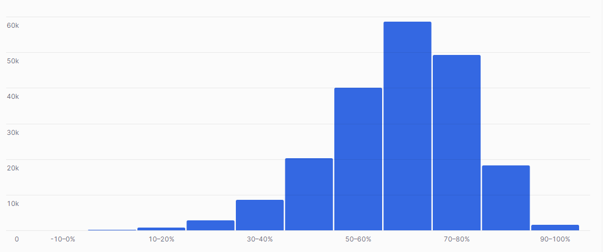

## ex78: Build a Margin Histogram — Bin All Items by Profitability

> **Type:** Core | **Track:** Business Strategist  
>
> **Difficulty:** 6 / 10

### Business context
You’ve helped the finance team identify the most and least profitable products. Now, they want a **clear visualization of margin distribution** across all items — not just the extremes.

Your task: group all parts into **10 percentage-point margin buckets** (e.g. `-10-0%`, `0–10%`, `30–40%`, etc), including those with negative margins, and produce a count of items in each. The goal is to generate a histogram-ready output where each bucket has a **human-readable label** describing the margin range.

Ensure that the histogram can be ordered and sorted properly.

**Business logic & definitions:**
* Net revenue = `L_EXTENDEDPRICE * (1 - L_DISCOUNT)`
* Cost = `PS_SUPPLYCOST * L_QUANTITY`
* Margin % = `(Revenue − Cost) / Revenue * 100`
* Bucket width = 10%
* Bucket logic: use `FLOOR(margin / 10)` to find the lower bound of each bucket
* Label logic: convert numeric bounds into strings like `"10–20%"`, `"−10–0%"`, etc

**Technical constraint:**
* Try to avoid **using `CASE WHEN`** for labeling or bucketing, but try math + `CONCAT()` instead.

### Starter query
```sql
-- Explore how margin values relate to pricing and cost
SELECT
    L.L_PARTKEY,
    L.L_SUPPKEY,
    L.L_EXTENDEDPRICE,
    L.L_DISCOUNT,
    PS.PS_SUPPLYCOST,
    L.L_QUANTITY
FROM SNOWFLAKE_SAMPLE_DATA.TPCH_SF1.LINEITEM L
JOIN SNOWFLAKE_SAMPLE_DATA.TPCH_SF1.PARTSUPP PS
    ON L.L_PARTKEY = PS.PS_PARTKEY AND L.L_SUPPKEY = PS.PS_SUPPKEY
LIMIT 10;
```

### Required datasets

* `SNOWFLAKE_SAMPLE_DATA.TPCH_SF1.LINEITEM`
* `SNOWFLAKE_SAMPLE_DATA.TPCH_SF1.PARTSUPP`

<details>
<summary>💡 Hint (click to expand)</summary>

#### How to think about it

You’ll first calculate margin per part (safely avoiding division by zero). Then, use `FLOOR(margin / 10)` to create a lower-bound integer for the bin.

To get a human-readable label like `"20–30%"`, use:
```sql
CONCAT(FLOOR(margin / 10) * 10, '–', FLOOR(margin / 10) * 10 + 10, '%')
```

This avoids any `CASE` logic and generates consistent string labels for grouping.

#### Helpful SQL concepts

`FLOOR`, `CONCAT`, `GROUP BY`, `NULLIF`

```sql
-- Example: 17.6% → 10–20%
CONCAT(FLOOR(17.6 / 10) * 10, '–', FLOOR(17.6 / 10) * 10 + 10, '%')
```

</details>

<details>
<summary>✅ Solution (click to expand)</summary>

#### Working query

```sql
WITH line_details AS (
    SELECT
        L.L_PARTKEY,
        (L.L_EXTENDEDPRICE * (1 - L.L_DISCOUNT)) AS net_revenue,
        (PS.PS_SUPPLYCOST * L.L_QUANTITY) AS estimated_cost
    FROM SNOWFLAKE_SAMPLE_DATA.TPCH_SF1.LINEITEM L
    JOIN SNOWFLAKE_SAMPLE_DATA.TPCH_SF1.PARTSUPP PS
        ON L.L_PARTKEY = PS.PS_PARTKEY AND L.L_SUPPKEY = PS.PS_SUPPKEY
),

part_margin AS (
    SELECT
        L_PARTKEY,
        ROUND((SUM(net_revenue) - SUM(estimated_cost)) / NULLIF(SUM(net_revenue), 0) * 100, 2) AS margin_pct
    FROM line_details
    GROUP BY L_PARTKEY
),

bucketed AS (
    SELECT
        FLOOR(margin_pct / 10) * 10 AS lower_bound
    FROM part_margin
),

labeled AS (
    SELECT
        CONCAT(TO_VARCHAR(lower_bound), '–', TO_VARCHAR(lower_bound + 10), '%') AS margin_bucket,
        COUNT(*) AS num_parts,
        RANK() OVER (ORDER BY lower_bound) AS bucket_rank
    FROM bucketed
    GROUP BY lower_bound
)

SELECT
    margin_bucket,
    num_parts
FROM labeled
ORDER BY bucket_rank;
```

#### Why this works

This approach produces labeled buckets like `"−10–0%"`, `"0–10%"`, `"10–20%"` using only math and `CONCAT()`, with no `CASE WHEN` needed. It ensures **every part** is counted, even if margins are negative or fractional.

Your histogram should look as follows:


#### Business answer

The resulting histogram will show the **distribution of product margins**, helping finance decide if pricing or sourcing strategy needs structural changes across broad product categories.

#### Take-aways

* Learners can now generate clean, labeled buckets using SQL math
* They avoided the trap of verbose or rigid `CASE WHEN` logic
* Produced a histogram-ready table compatible with BI tools
* Reinforced safe division, aggregation, and formatting practices

</details>

<details>
<summary>🎁 Bonus Exercise (click to expand)</summary>

Generate the same histogram with:
- **5%-wide buckets** using `FLOOR(margin_pct / 5) * 5`
- **1%-wide buckets** using `FLOOR(margin_pct)`

Tip: encapsulate the logic in a CTE or reusable field to avoid duplication. What changes do you notice in the shape and granularity of the margin distribution?

</details>
