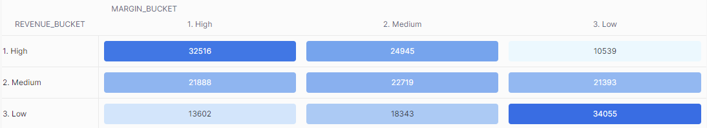

## ex79: Strategic Mapping of Revenue vs Margin — 9-Quadrant Table

> **Type:** Core | **Track:** Business Strategist  
>
> **Difficulty:** 8 / 10

### Business context
The CFO wants to understand whether TPCH's product portfolio reflects **strategic alignment between profitability and sales performance**. To support this, you've been asked to create a **strategic product matrix**: a 3×3 categorization of all parts, based on their **total revenue** and **profit margin**.

This 9-quadrant framework will help leadership identify:
- True star performers (high revenue, high margin)
- Margin traps (high revenue, low margin)
- Hidden gems (low revenue, high margin)
- Dead weight (low on both)

The matrix is meant to feed into executive dashboarding and product rationalization strategy.

Use **Snowflake's built-in Heatmap visualization** on the `margin_bucket × revenue_bucket` table to explore quadrant density.
Ensure your **bucket labels** allow for proper sorting in the heatmap layout.


**Business logic & definitions:**
* Net revenue = `L_EXTENDEDPRICE * (1 - L_DISCOUNT)`
* Cost = `PS_SUPPLYCOST * L_QUANTITY`
* Margin % = `(Revenue − Cost) / Revenue * 100`
* Revenue buckets: **Low**, **Medium**, **High** using revenue tertiles
* Margin buckets: **Low**, **Medium**, **High** using margin tertiles
* Output must be **in long format**, one row per margin × revenue quadrant, showing how many parts fall in each

### Starter query
```sql
-- Inspect inputs to margin and revenue logic
SELECT
    L.L_PARTKEY,
    L.L_EXTENDEDPRICE,
    L.L_DISCOUNT,
    PS.PS_SUPPLYCOST,
    L.L_QUANTITY
FROM SNOWFLAKE_SAMPLE_DATA.TPCH_SF1.LINEITEM L
JOIN SNOWFLAKE_SAMPLE_DATA.TPCH_SF1.PARTSUPP PS
    ON L.L_PARTKEY = PS.PS_PARTKEY AND L.L_SUPPKEY = PS.PS_SUPPKEY
LIMIT 10;
```

### Required datasets

* `SNOWFLAKE_SAMPLE_DATA.TPCH_SF1.LINEITEM`
* `SNOWFLAKE_SAMPLE_DATA.TPCH_SF1.PARTSUPP`

<details>
<summary>💡 Hint (click to expand)</summary>

#### How to think about it

Start by computing total revenue and margin % per part. Use `PERCENTILE_CONT(0.33)` and `0.66` to split revenue and margin into **tertiles**.

Assign bucket labels like `'Low'`, `'Medium'`, `'High'` using `CASE` logic or inline `IF` statements. Once each part is assigned two buckets, **group by those two buckets** to count how many parts fall in each quadrant.

#### Helpful SQL concepts

`PERCENTILE_CONT`, `CASE`, `CROSS JOIN`, `GROUP BY`

```sql
-- Example bucketing logic
CASE
  WHEN metric < p33 THEN 'Low'
  WHEN metric < p66 THEN 'Medium'
  ELSE 'High'
END
```

</details>

<details>
<summary>✅ Solution (click to expand)</summary>

#### Working query

```sql
WITH line_details AS (
    SELECT
        L.L_PARTKEY,
        (L.L_EXTENDEDPRICE * (1 - L.L_DISCOUNT)) AS net_revenue,
        (PS.PS_SUPPLYCOST * L.L_QUANTITY) AS estimated_cost
    FROM SNOWFLAKE_SAMPLE_DATA.TPCH_SF1.LINEITEM L
    JOIN SNOWFLAKE_SAMPLE_DATA.TPCH_SF1.PARTSUPP PS
        ON L.L_PARTKEY = PS.PS_PARTKEY AND L.L_SUPPKEY = PS.PS_SUPPKEY
),

part_metrics AS (
    SELECT
        L_PARTKEY,
        SUM(net_revenue) AS total_revenue,
        ROUND(
            (SUM(net_revenue) - SUM(estimated_cost)) / NULLIF(SUM(net_revenue), 0) * 100, 2
        ) AS margin_pct
    FROM line_details
    GROUP BY L_PARTKEY
),

percentile_bounds AS (
    SELECT
        PERCENTILE_CONT(0.33) WITHIN GROUP (ORDER BY margin_pct) AS margin_33,
        PERCENTILE_CONT(0.66) WITHIN GROUP (ORDER BY margin_pct) AS margin_66,
        PERCENTILE_CONT(0.33) WITHIN GROUP (ORDER BY total_revenue) AS revenue_33,
        PERCENTILE_CONT(0.66) WITHIN GROUP (ORDER BY total_revenue) AS revenue_66
    FROM part_metrics
),

bucketed_parts AS (
    SELECT
        pm.L_PARTKEY,
        CASE
            WHEN pm.margin_pct >= pb.margin_66 THEN '1. High' -- Prefixing with numbers enables out-of-the-box sorting
            WHEN pm.margin_pct >= pb.margin_33 THEN '2. Medium'
            ELSE '3. Low'
        END AS margin_bucket,
        CASE
            WHEN pm.total_revenue >= pb.revenue_66 THEN '1. High'
            WHEN pm.total_revenue >= pb.revenue_33 THEN '2. Medium'
            ELSE '3. Low'
        END AS revenue_bucket
    FROM part_metrics pm
    CROSS JOIN percentile_bounds pb
)

SELECT
    margin_bucket,
    revenue_bucket,
    COUNT(*) AS part_count
FROM bucketed_parts
GROUP BY margin_bucket, revenue_bucket
ORDER BY margin_bucket, revenue_bucket;
```

#### Why this works

This query computes **per-part revenue and margin**, then assigns each one to a strategic bucket based on dynamic distribution cutoffs. The long-format output enables **heatmap visualizations directly in Snowflake**.

Your visualization should look like this:


#### Business answer

The largest group of products was found in the **low-margin, low-revenue quadrant**, with over 34,000 items.

This insight supports portfolio pruning and targeted margin optimization for underperformers.

#### Take-aways

* Reinforced strategic mapping via data-driven bucketing
* Learned to construct quantile-based labeling systems in SQL
* Produced flexible, chartable outputs for exec storytelling
* Opened the door to visual pattern detection (e.g. heatmaps)

</details>

<details>
<summary>🎁 Bonus Exercise (click to expand)</summary>

Pivot the output into a 3×3 matrix where:
- **Rows = margin_bucket**
- **Columns = revenue_bucket**
- **Values = COUNT of parts**

Use `COUNT_IF(...)` or conditional aggregation with `GROUP BY margin_bucket`. You can sort the rows using a `CASE`-based numeric rank on bucket order.

Are you still able to visualize this output table as easily?

</details>
